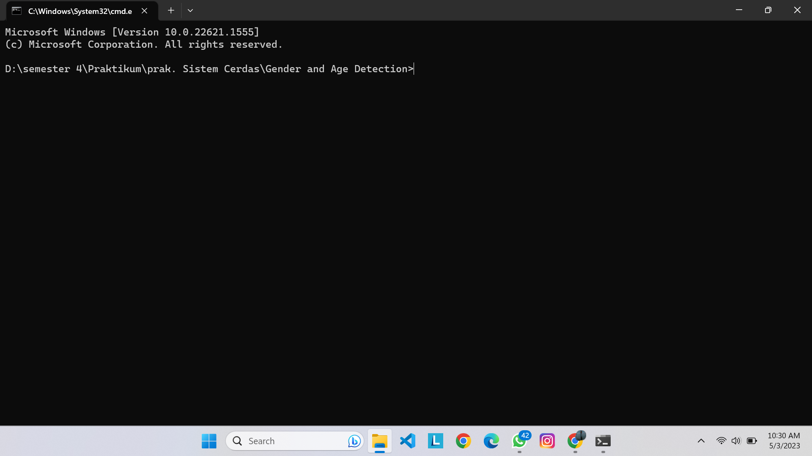
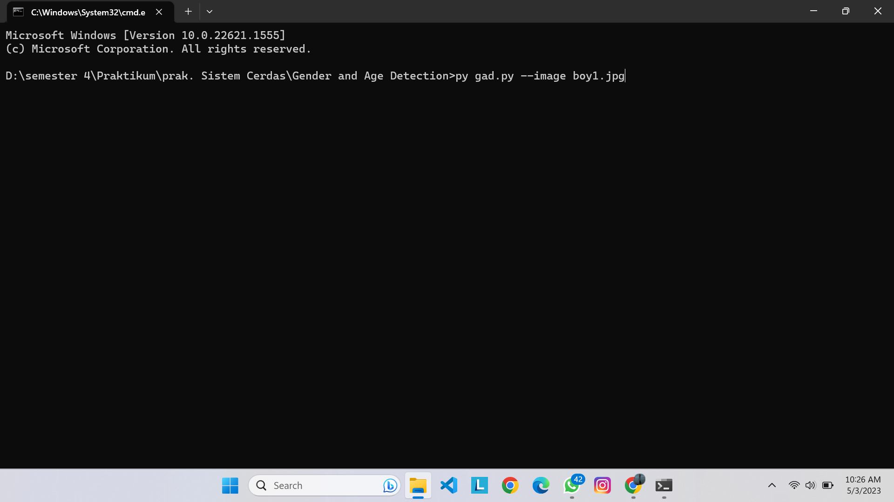
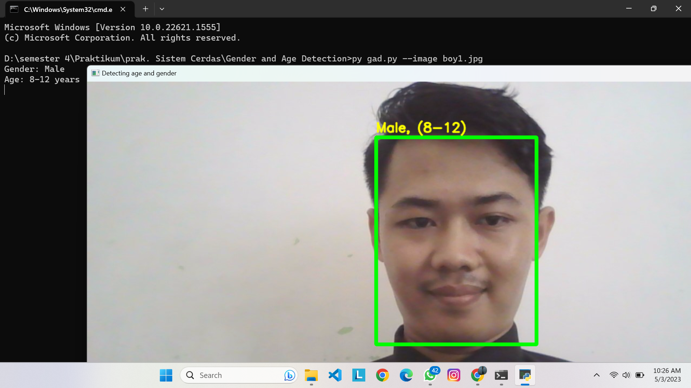

# Tugas Praktikum Sistem Cerdas Handwritten digit recognizer

## Latar Belakang

Teknologi analisis wajah berbasis kecerdasan buatan telah menjadi sangat penting. Faktor terpenting yang mendasari popularitas teknologi ini adalah bahwa teknologi tersebut dapat digunakan dengan sangat efektif dalam kehidupan bisnis. Berkat teknologi ini, seperti segmentasi pelanggan, pengembangan produk, dan buku harian bisnis semuanya menjadi lebih baik. Teknologi kecerdasan buatan yang paling banyak digunakan berdasarkan analisis wajah adalah teknologi deteksi usia dan deteksi jenis kelamin wajah . Teknologi ini memberikan solusi toko online dan fisik yang sangat efektif, metode pemasaran, peningkatan layanan, dan pengembangan produk.

### Nama Mahasiswa

1. M. Riyan Hidayatulloh (21220003)

<br/>
<br/>

## Dependencies

- Flask 2.0.1 or greater

## Requirements and installation

To install library, simply:

```bash
> pip install opencv-python
```

## Running

manually by running:

```bash
> Python "namafile".py
```

Buka lokasi file.

<p align="center">
    
    <br>
 </p>
 
kemudian ketik cmd seperti pada gambar dibawah.
<p align="center">
    
    <br>
 </p>
 
pastikan cmd sudah masuk ke direktori yang dituju.
<p align="center">
    
    <br>
 </p>
 
ketik perintah seperti di bawah.
<p align="center">
    
    <br>
 </p>

kemudian akan muncul hasil gambar detection

 <p align="center">
    
    <br>
 </p>
